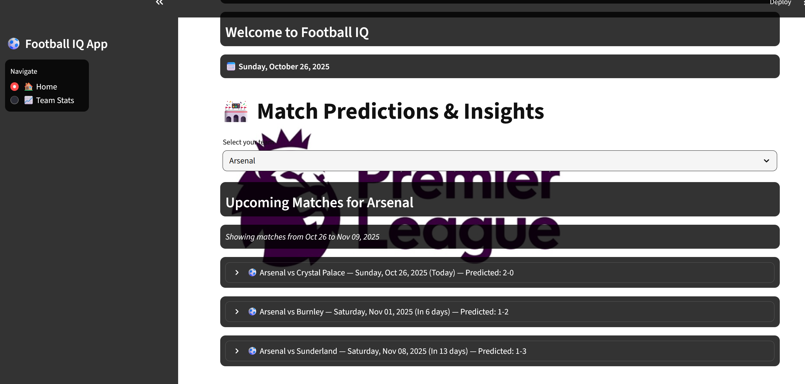

# Soccor Analytics using ML and AI
Score prediction for EPL matches and team-specific recommendations to improve gaol probabilities per match
**Football IQ : Predictive Insights for Winning Stratergies**

## SECTION 1 : PROJECT TITLE
## Football IQ : Predictive Insights for Winning Stratergies

---

## SECTION 2 : EXECUTIVE SUMMARY / PAPER ABSTRACT
The increasing availability of football data and advances in data analytics have opened new avenues for performance optimization and strategic decision-making in professional football. This project focuses on developing a robust, data-driven system to predict football match scores and provide actionable insights to team managers, enabling them to make informed decisions before, during, and after matches.

The system leverages historical match data, player statistics, team formations, and contextual factors such as opponent strength and recent form to generate accurate predictions of match outcomes. Advanced machine learning techniques, including regression models are applied to capture complex relationships between match features and outcomes. Special attention is given to modeling player performance, positional dynamics, and tactical formations, ensuring that predictions reflect both individual contributions and overall team strategy.

Beyond predicting scores, the platform offers detailed analytical insights into team performance, identifying strengths, weaknesses, and areas for improvement. These insights include player-level metrics, fatigue and form trends, tactical effectiveness of formations, and potential impact of transfers or substitutions. By visualizing these insights, the system assists managers in squad selection, tactical planning, and in-game decision-making, ultimately supporting data-driven management practices.

In conclusion, this project demonstrates the potential of combining football analytics with advanced predictive modeling to enhance competitive advantage. By providing both accurate match predictions and actionable insights, the system empowers team managers to optimize player utilization, refine tactical approaches, and make informed decisions under uncertainty. Future extensions may include integration of injury reports, real-time match updates, sentiment analysis from football news, and cross-league performance evaluation, further strengthening the utility and relevance of this platform in modern football management.

---

## SECTION 3 : CREDITS / PROJECT CONTRIBUTION

| Official Full Name  | Student ID (MTech Applicable)  | Work Items (Who Did What) | Email (Optional) |
| :------------ |:---------------:| :-----| :-----|
| ZHANG HENGDA | A0329373X | Ideation, Clustering for prediction of Dream 11, Recommendation of player insights using clustering| e1553700@u.nus.edu |
| SANDESH SREEPATHY UPADHYAYA | A0327834X | Ideation, Webscraping for Data, Scoreline prediction using Elo Rating | e1456589@u.nus.edu|
| SHANTAM SHARMA | A0329623B | Ideation , Recommendation of Team Insights using SHAP with XGBoost, Creation of UI using Streamlit |shantam.s@u.nus.edu|

---
